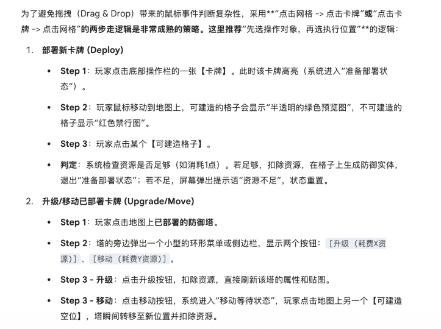

# 塔防对战游戏 · 项目文档

> 本文档为全组共用的设计规范与开发指南，涵盖界面交互流、核心系统架构、战斗逻辑、数据管理、项目分工、开发顺序、目录结构及 Qt 环境配置，供六位成员全程参考。

---

## 目录

1. [界面导航与交互流设计](#一-界面导航与交互流设计-ui-flow)
2. [核心系统架构（OOP 设计）](#二-核心系统架构-oop-设计)
3. [地图与战斗深度逻辑](#三-地图与战斗深度逻辑)
4. [PVP 阶段性与机制](#四-pvp-阶段性与机制)
5. [数据管理与文件 I/O](#五-数据管理与文件-io-硬核实现)
6. [技能系统与开发约束](#六-技能系统与开发特别说明约束)
7. [项目分工](#七-项目分工)
8. [项目开发顺序](#八-项目开发顺序)
9. [项目目录结构](#九-项目目录结构)
10. [Qt 环境配置与使用说明](#十-qt-环境配置与使用说明)

---

## 一、 界面导航与交互流设计 (UI Flow)

### 1. 起始页面 (Start Menu)

* **功能**：游戏入口，玩家在此选择模式或进入设置。
* **交互按钮**：
    * **[单人 PVE]**：进入 PVE 配置页面，选择地图与难度后开始游戏。
    * **[多人 PVP]**：进入 PVP 配置页面，选择创建或加入房间。
    * **[图鉴/仓库]**：直接跳转至"战前选卡与图鉴"合一页面，可提前编排出战卡组。
    * **[设置]**：进入音量、分辨率等系统设置。
    * **[退出]**：关闭游戏进程。

---

### 2. 配置与大厅页面 (Config & Lobby)

* **PVE 模式**：选择地图、难度（简单 / 普通 / 困难），确认后跳转至战前选卡页。
* **PVP 模式**：
    * **[创建房间]**：作为服务端（Host）监听本机端口，等待对方连接。
    * **[加入房间]**：输入对方 IP 地址，以客户端身份发起连接。

#### 局域网大厅实现方案 (PVP Lobby - 方案 B)

* **操作机制**：使用 Qt 的 `QTcpServer` 和 `QTcpSocket` 实现点对点通信。
* **状态同步**：波次开始时双方同步"随机数种子"，确保刷怪序列完全一致，避免不同步导致的双方怪物表现差异。

---

### 3. 战前选卡与全图鉴页面 (Deck & Atlas)

> **设计说明**：将图鉴与选卡功能合并至同一页面（参考《明日方舟》编队界面）。玩家在点击卡牌查看详细数值的同时，决定是否将其带入战斗。共有四种固定编队槽位供玩家在外部预先配置，进入战斗时从中选择一套编队即可开战。

#### 全图鉴卡池（上半部分）

点击任意卡片，在右侧面板或浮窗中显示以下详细信息：

* **基础属性**：HP、攻击力、攻击距离、攻击间隔。
* **升级消耗**：展示 Lv1 → Lv2 → Lv3（可能等级更高） 所需的资源数量。
* **移动属性**：单次瞬移的最大距离限制、每格移动的资源消耗系数。
* **索敌逻辑 (Priority)**：显示该卡牌的目标优先级列表，例如：
    * *采矿工*：`[资源单位] > [怪物] > [敌方核心]`
    * *狙击手*：`[高血量怪] > [普通怪] > [资源单位]`
    （索敌逻辑的书写可能比较繁琐，请开发者自行思考如何通过复用减少工作量）

#### 出战卡槽（下半部分）

* **槽位数量**：固定 5 个位置。
* **选卡逻辑**：从卡池点击卡片填入卡槽；已填入的卡片再次点击则从卡槽中移除。
* **[开始战斗] 状态逻辑**：
    * 若卡槽**未满**：按钮呈灰色，显示 `Disabled` 状态，无法点击。
    * 若卡槽**已满**：按钮高亮可点击，点击后跳转至地图/模式选择或直接加载战斗。

---

### 4. 局内战斗页面 (Battle UI)



#### 视口与状态栏布局

* **主视口（中央）**：展示 2D 网格地图，包含路径、障碍物、高台、怪物出生点等地形元素。
* **状态栏（顶部）**：实时显示当前波次编号、核心血量、当前资源点数。
* **操作栏（底部）**：展示本场选定的卡牌列表及可用的技能按钮。

> 目标表现细节参考：详尽程度应与下方图示（image-1、image-2、image-3）一致，包括格子高亮、数值浮窗、环形菜单等视觉反馈。

#### 部署交互（两步走）

1. 在底部操作栏点击一张卡牌 → 地图上所有**可部署格**高亮显示。
2. 点击高亮格确认部署 → 系统检查资源是否充足，充足则生成实体，否则显示"资源不足"提示。

#### 单位环形菜单

点击已部署的己方单位，在单位周围弹出三个扇形按键：

* **[升级]**：扣除固定资源，提升该单位至下一等级（最高 Lv3）。
* **[移动]**：进入"瞬移模式"，地图上显示有效射程内的可移动格；点击目标格后根据移动距离扣除相应资源。距离越远消耗越高。
* **[撤回]**：将单位从地图移除，返还少量资源（低于初始部署消耗）。

#### 状态反馈

* 当资源不足以执行**升级**或**移动**操作时，对应的环形菜单按键显示为置灰不可操作状态，并给出文字提示。

---

## 二、 核心系统架构 (OOP 设计)

本游戏采用面向对象设计，核心类体系如下。

### 1. GameObject（基类）

所有游戏对象的根类，提供最基础的坐标与类型信息。

| 属性 / 方法 | 说明 |
| :--- | :--- |
| `int ID` | 对象唯一标识符 |
| `float posX, posY` | 在网格中的坐标 |
| `ObjectType type` | 枚举：实体（Entity）/ 地形（Terrain） |
| `virtual void draw()` | 纯虚方法，子类实现具体绘制逻辑 |
| `virtual void update()` | 纯虚方法，子类实现每帧更新逻辑 |

---

### 2. Entity（动态实体基类）

继承自 `GameObject`，表示地图上可动、可交互的对象。

#### Card（防御单位类）

玩家部署的防御塔，所有防御单位均继承此类。

| 属性 | 说明 |
| :--- | :--- |
| `int level` | 当前等级（1 ~ 3） |
| `int maxHP` / `currentHP` | 最大血量 / 当前血量 |
| `int attackRange` | 攻击格数范围 |
| `int moveLimit` | 单次瞬移最大步长 |
| `std::vector<PriorityType> priorityList` | 索敌优先级队列 |
| `float skillCooldown` | 技能冷却时间（秒） |

**核心行为**：`autoSkill()` —— 每当冷却完毕且范围内存在目标时，自动释放技能，无需玩家手动操作。

**派生类**：

* `AttackUnit`：攻击型炮塔，以造成伤害为主。
* `ProduceUnit`：生产型单位（产矿 / 兵工厂），定时产出资源。
* `HealUnit`：治疗型单位（医生），对范围内友方单位回血。

---

#### Monster（怪物类）

由系统按波次配置自动生成，沿路径向玩家大本营移动。

| 属性 | 说明 |
| :--- | :--- |
| `float speed` | 移动速度（格/秒） |
| `int rewardMoney` | 被击杀后掉落的资源数量 |
| `int damageToBase` | 到达终点后对核心造成的伤害值 |
| `int pathIndex` | 当前所在路径节点的索引 |

**核心行为**：
* `AStarMove()`：每帧调用，使用 A* 算法计算下一步移动方向。
* `onDeath()`：死亡时触发，执行掉落资源逻辑。

**特殊怪物类型**（参考《明日方舟》怪物设计逻辑）：

| 类型 | 特点说明 |
| :--- | :--- |
| `Sapper`（拆迁怪） | 路径上优先攻击高台单位而非直奔终点 |
| 远程攻击怪 | 具有攻击射程，可在移动途中攻击防御单位 |
| 肉盾怪 | 高血量、低速度，需集中火力处理 |
| 狂暴怪 | 每次受到攻击后攻击速度提升，越打越快 |

> 更多怪物类型可参照《明日方舟》怪物机制持续扩充。

---

### 3. MapGrid（静态地块类）

表示地图上一个网格单元，存储地形信息。

| 属性 | 说明 |
| :--- | :--- |
| `TerrainType terrainType` | 枚举：路径 / 高台 / 平地 / 不可部署 |
| `bool isOccupied` | 当前格是否已有单位占据 |
| `int heightValue` | 高度值（0 = 地面，1 = 高台） |

---

## 三、 地图与战斗深度逻辑

### 1. 地形高低差惩罚

* **减伤计算**：若攻击者高度（`attacker.height`）低于目标高度（`target.height`），则最终造成伤害降低（例如减少 30%）。
* **射程优势**：高台单位（`heightValue = 1`）可能拥有额外 +1 格的攻击射程加成。

---

### 2. 瞬移移动 (Chess-like Move)

* **规则**：单位瞬间改变坐标位置，中途不产生位移路径，不触发经过格的任何效果或攻击。
* **限制**：目标格必须为"可部署区块"且当前未被占用；移动距离不得超过该单位的 `moveLimit`。
* **消耗公式**：

$$
\text{移动消耗} = \text{基础消耗} + (\text{移动距离} \times \text{距离系数})
$$

距离越远，消耗越高。

---

### 3. 资源单位与索敌优先级 (Priority)

* **索敌逻辑实现**：每帧遍历当前攻击范围内的所有 `Entity*`，将目标列表根据单位自身的 `priorityList` 进行排序，选取权值最高的目标锁定并发动攻击。数据结构为 `std::vector<Entity*>`，排序使用自定义比较器。

---

### 4. 地图组成与地形要素

地图由以下元素构成：

| 元素类型 | 说明 |
| :--- | :--- |
| **保卫点（核心）** | 玩家大本营，血量归零即失败 |
| **怪物出生点** | 每波怪物从此处生成并开始行进 |
| **路径（PATH）** | 怪物的可行走区域，不可部署防御单位 |
| **不可部署区块** | 地图边缘或特殊障碍，既不可走也不可建 |
| **可部署区块** | 玩家放置防御单位的合法格 |
| **高台区块** | 高度为 1，部署于此的单位享受射程与减伤优势 |

* **网格化实现**：采用二维数组（如 `int map[20][30]`）记录每格的地块类型，运行时通过解析 `map_data.csv` 进行初始化。
* **视觉表现**：虽然底层是规则二维数组，但美术上支持不规则曲线划分，以增强游戏代入感。

---

### 5. 战斗与移动逻辑

* **寻路机制**：采用 **A\*（A-Star）算法**。每当玩家新建或移动防御单位时，场内所有怪物重新计算通往大本营的最优路径。//应该不用，不会因为你的部署发生改变，因为我们的波次是在部署阶段结束后随机出来的，理论上路径是固定的
* **防堵死说明**：由于本游戏**不存在**可部署于怪物路径上的地面阻挡单位，路径完全封死的情况无需额外判断处理。
* **单位移动**：支持瞬移模式（类似象棋走法），移动过程中不触发攻击，一次移动距离受 `moveLimit` 约束，距离越远消耗资源越多。
* **索敌逻辑**：根据每张卡牌自身属性（攻击范围、优先级列表）自动判定攻击目标，无需玩家手动指定。

---

## 四、 PVP 阶段性与机制

### 阶段划分

| 阶段 | 波次 (Wave) | 特点描述 |
| :--- | :--- | :--- |
| **前期（资源期）** | 0 ~ n 波 | 路径上**不刷怪**。公共区域生成"资源运输单位"，它们不会主动攻击，血量较低，玩家需部署生产或攻击单位争夺这些资源。大本营设有保护盾，此阶段受损不计入最终分。 |
| **中期（拉锯期）** | n ~ m 波 | 正式开始刷怪，怪物沿路径向大本营推进，击杀掉落中等资源。玩家需在"争夺公共区资源"与"守卫己方大本营"之间做出取舍。 |
| **后期（决战期）** | m 波以后 | 公共区资源单位**停止刷新**，怪物属性大幅提升。玩家只能依靠存量资源和击杀奖励维持运营，直至一方核心血量归零为止。 |

---

### 拼点踩死机制 (Clash)

当玩家 A 的单位瞬移至玩家 B 单位所在的格子时，触发碰撞判定：

* **判定公式**：比较双方的 `(攻击力 + 剩余血量百分比)` 综合战斗值。
* **胜负结果**：
    * 败者单位**直接消失**。
    * 胜者单位**保留**，但扣除等同于败者 50% 血量的生命值作为代价。

---

### 迷雾部署

* 部署阶段双方互不可见，己方单位的位置信息直到游戏正式开始后才向对方同步，增加信息博弈深度。

---

## 五、 数据管理与文件 I/O (硬核实现)

本游戏使用三种文件格式管理持久化数据，均通过标准 C++ 文件流操作实现，不依赖第三方数据库。

### 1. `level_config.txt`（波次配置文件，顺序读取）

* **格式**：`WaveID | MonsterType | Count | Interval | HealthMultiplier`
* **作用**：游戏循环中通过 `std::ifstream` 逐行读取，按行触发对应波次的怪物生成逻辑。每行代表一个波次的完整生成指令。

### 2. `user_profile.dat`（用户存档文件，随机读写 - 二进制）

* **格式**：
    ```cpp
    struct UserData {
        char name[20];
        int  maxScore;
        int  winCount;
        int  unlockMask;  // 位掩码，记录已解锁的卡牌
    };
    ```
* **作用**：使用 `fstream::seekp` 配合 `write` 实现定点覆写。例如玩家打破纪录时，直接定位至 `maxScore` 字段的字节偏移量进行覆盖更新，无需重写整个文件，读写效率高。

### 3. `map_data.csv`（地图数据文件，解析读取）

* **格式**：`Row, Col, GridType, Height`（示例：`0, 5, PATH, 0`）
* **作用**：游戏启动加载地图时，逐行解析文本内容，将每条记录填入对应坐标的 `MapGrid` 对象，完成二维地图数组的初始化。

---

## 六、 技能系统与开发特别说明（约束）

### 技能系统

* **自动释放机制**：每个防御单位内置独立计时器（`Timer`）。以"AOE 炮塔"为例，其"过载射击"技能每隔 10 秒自动触发一次，持续 3 秒内攻击频率翻倍，无需玩家手动操作。
* **无坚果策略说明**：本游戏没有类似《植物大战僵尸》的"坚果墙"（Wall-nut）类阻挡单位，玩家必须通过合理的单位**移动**与**火力覆盖**来保护大本营核心。

### 开发约束（明确不做的功能）

| 约束项 | 说明 |
| :--- | :--- |
| 技能释放方式 | 全部单位技能均为**自动释放**，不实现手动释放逻辑 |
| 地面阻挡单位 | **不考虑**可部署于路径上的地面阻挡型单位 |
| 坚果墙 / 地磁 | 系统中**不存在**此类特殊限制单位 |
| 防堵死检测 | 由于没有路径阻挡单位，此逻辑**无需实现** |
| PVE 奖励差异 | PVE 模式击杀怪物掉落资源**多于** PVP 模式 |

---

## 七、 项目分工

全组共六人，按模块独立开发，接口需提前约定，便于后期集成。

> **说明**：以上分工为建议划分，具体人员姓名请由组长填入"成员 A/B/C..."处。各模块负责人需在开发前输出本模块的接口文档（类定义头文件），经全组评审后方可开始实现。

| 编号 | 负责人 | 主要模块 | 具体职责 |
| :---: | :---: | :--- | :--- |
| 1 | 成员 A | **核心游戏逻辑** | `GameObject` / `Entity` / `Card` / `Monster` 类体系实现；A* 寻路算法；战斗伤害计算与技能自动释放 |
| 2 | 成员 B | **地图 & 关卡数据** | `MapGrid` 二维数组初始化；高低差地形判定；`map_data.csv` 解析；`level_config.txt` 波次配置；`user_profile.dat` 存档读写 |
| 3 | 成员 C | **UI 界面** | Qt 起始页面、配置/大厅页面、战前选卡页面、战斗界面（主视口 + 状态栏 + 操作栏 + 环形菜单）设计与实现 |
| 4 | 成员 D | **PVP 网络** | `QTcpServer` / `QTcpSocket` 通信；随机数种子同步；迷雾部署数据传输；拼点踩死判定同步 |
| 5 | 成员 E | **美术资源** | 制定贴图规格（尺寸 / 格式 / 命名规范）；协调全组搜索卡牌 / 怪物 / 地形图并汇总；编写并维护 `resources.qrc` 资源打包文件；游戏图标 |
| 6 | 成员 F | **集成测试** | 验收各模块接口是否与约定一致；控制 git 分支合并节奏；性能优化；全程 Bug 追踪与修复 |

### 美术资源协作说明

> 成员 E 是**协调者**，实际搜索贴图由全组共同完成。每个人在自己负责的功能开发完毕后，在不影响进度的前提下抽空按 E 制定的规格去搜索对应图片，发到群里汇总。具体分工（如谁搜卡牌、谁搜怪物）由 E 在 Phase 1 结束前在群里分配。

---

## 八、 项目开发顺序

采用"由底层到上层、由单机到联机"的渐进式开发策略，分四个阶段推进。

### Phase 0 · 环境搭建与接口约定（第 1 周）

> 目标：让六人都能在本机成功编译运行一个空白 Qt 窗口，并确认所有接口头文件。

- [ ] 所有成员完成 Qt 环境配置（详见第十节）
- [ ] 创建 Git 仓库，建立分支规范（`main` / `dev` / `feature/xxx`）
- [ ] 确定项目目录结构（详见第九节），建立空文件骨架
- [ ] 各模块负责人输出头文件（`.h`），经全组 Code Review 后冻结接口

---

### Phase 1 · 核心逻辑与地图（第 2 ~ 3 周）

> 目标：能在命令行 / 简单窗口中跑通一局基础 PVE 流程（无精美 UI）。
>
> **⚠️ 贴图时机说明**：Phase 1 ~ 2 全部使用**纯色方块**（Qt `QPainter` 直接画矩形填充）代替贴图，不需要等美术资源。成员 E 在此阶段应开始制定贴图规格（尺寸、格式、命名），成员 E/F 协调全组在有空时搜索参考图，但**不要影响核心开发进度**。真实贴图在 Phase 4 一次性替换。

- [ ] 实现 `GameObject` → `Entity` → `Card` / `Monster` 类体系
- [ ] 实现 `MapGrid` 与 `map_data.csv` 解析，渲染基础二维网格
- [ ] 实现 A* 寻路算法，怪物能沿路径移动至终点
- [ ] 实现基础波次加载（读取 `level_config.txt`）
- [ ] 实现防御单位部署、攻击、伤害计算的基础逻辑
- [ ] （同步进行）E 制定贴图规格；全组有空时搜索并汇总参考图

---

### Phase 2 · UI 界面与单机完整流程（第 4 ~ 5 周）

> 目标：完整的单机 PVE 游戏可以正常游玩，有完整的界面切换流程。
>
> **⚠️ 贴图状态**：继续使用纯色方块占位。所有 UI 交互（按钮、环形菜单、状态栏）优先保证逻辑正确，视觉细节在 Phase 4 统一美化。

- [ ] 实现起始页面、配置页面、战前选卡页面
- [ ] 实现战斗主界面（主视口 + 状态栏 + 操作栏 + 环形菜单）
- [ ] 实现技能自动释放系统（`Timer` + `autoSkill()`）
- [ ] 实现升级 / 移动 / 撤回交互与资源扣除
- [ ] 实现高低差减伤、瞬移消耗公式
- [ ] 实现 `user_profile.dat` 存档读写

---

### Phase 3 · PVP 联机功能（第 6 ~ 7 周）

> 目标：两台机器在局域网内能正常完成一局 PVP 对战。

- [ ] 实现 `QTcpServer` / `QTcpSocket` 基础通信框架
- [ ] 实现大厅"创建 / 加入房间"功能
- [ ] 实现随机数种子同步与波次怪物一致性验证
- [ ] 实现迷雾部署（部署阶段双方数据不互通，开战后同步）
- [ ] 实现 PVP 三阶段资源机制（资源期 / 拉锯期 / 决战期）
- [ ] 实现拼点踩死判定与网络同步

---

### Phase 4 · 美术、优化与答辩准备（第 8 周）

> 目标：游戏可展示，代码规范，文档完整。
>
> **美术资源**在此阶段正式替换所有占位方块：E 汇总全组搜索的贴图并验收质量，按规格整理后写入 `resources.qrc` 一次性替换。

- [ ] 导入全部美术资源（贴图、音效）
- [ ] 性能优化（寻路缓存、对象池）
- [ ] 完善错误处理与边界条件
- [ ] 编写最终技术文档与答辩 PPT

---

## 九、 项目目录结构

> 采用多模块静态库架构，`app/` 生成最终可执行文件，链接下方五个静态库。各模块职责严格分离：`core/` 不依赖 Qt，其余模块通过接口与 `core/` 交互。

### 最终构建产物

```
GameProject（可执行文件）
├── game_core          ← 纯 C++ 静态库（不依赖 Qt）
├── game_ui            ← Qt Widgets 静态库
├── game_network       ← Qt Network 静态库
├── game_data_manager  ← 数据读写静态库
└── game_resources     ← Qt 资源打包静态库（仅含 .qrc）
```

### 完整目录结构

```
GameProject/
├── CMakeLists.txt                         # 顶层 CMake：统一 add_subdirectory()
├── README.md                              # 项目说明文档
│
├── app/                                   # 【应用层】负责模块装配、页面流、游戏会话
│   ├── CMakeLists.txt                     # 生成最终可执行程序 GameProject
│   ├── include/app/
│   │   ├── GameApplication.h              # 程序总入口：创建窗口、控制器、数据中心
│   │   ├── GameSession.h                  # 当前游戏会话：PVE/PVP、地图、难度、卡组
│   │   ├── GameController.h               # 总控制器：接收 UI 命令，调用 core/network/data
│   │   ├── NavigationController.h         # 页面跳转控制器
│   │   ├── GameLoop.h                     # 游戏主循环：QTimer 驱动 core 更新
│   │   └── ViewModelMapper.h              # 把 core 数据转换成 UI ViewModel
│   └── src/
│       ├── main.cpp                       # QApplication 初始化，启动 GameApplication
│       ├── GameApplication.cpp
│       ├── GameSession.cpp
│       ├── GameController.cpp
│       ├── NavigationController.cpp
│       ├── GameLoop.cpp
│       └── ViewModelMapper.cpp
│
├── core/                                  # 【核心逻辑层】纯 C++，不依赖 Qt
│   ├── CMakeLists.txt                     # 编译 game_core 静态库
│   ├── include/core/
│   │   ├── base/
│   │   │   ├── GameObject.h               # 游戏对象基类：ID、坐标、对象类型
│   │   │   ├── Entity.h                   # 动态实体基类：HP、阵营、状态
│   │   │   ├── Constants.h                # 核心逻辑常量
│   │   │   └── CoreTypes.h                # Team、ObjectType、TerrainType 等枚举
│   │   ├── units/
│   │   │   ├── Card.h                     # 防御单位基类
│   │   │   ├── AttackUnit.h               # 攻击型单位
│   │   │   ├── ProduceUnit.h              # 生产型单位
│   │   │   ├── HealUnit.h                 # 治疗型单位
│   │   │   ├── Monster.h                  # 怪物基类
│   │   │   └── MonsterTypes.h             # 怪物类型定义
│   │   ├── map/
│   │   │   ├── MapGrid.h                  # 单个地块：类型、高度、占用状态
│   │   │   ├── Map.h                      # 地图容器：二维网格数组
│   │   │   ├── MapPosition.h              # 行列坐标、世界坐标转换
│   │   │   └── AStar.h                    # A* 寻路算法
│   │   ├── combat/
│   │   │   ├── DamageCalculator.h         # 伤害、高台减伤、拼点计算
│   │   │   ├── TargetSelector.h           # 索敌优先级选择
│   │   │   ├── Projectile.h               # 投射物逻辑
│   │   │   ├── Buff.h                     # Buff 数据结构
│   │   │   └── BuffManager.h              # 减速、眩晕、攻速变化等状态管理
│   │   ├── systems/
│   │   │   ├── BattleManager.h            # 战斗总管理：单位列表、胜负判定、update
│   │   │   ├── ResourceManager.h          # 金币/矿石/资源点管理
│   │   │   ├── CardSystem.h               # 卡牌部署、升级、撤回、费用判断
│   │   │   ├── WaveSpawner.h              # 波次生成器
│   │   │   └── SkillSystem.h              # 自动技能系统
│   │   └── snapshot/                      # 给 app/UI 使用的只读状态快照
│   │       ├── BattleSnapshot.h           # 当前战斗完整状态
│   │       ├── UnitSnapshot.h             # 防御单位显示数据
│   │       ├── MonsterSnapshot.h          # 怪物显示数据
│   │       └── MapSnapshot.h              # 地图显示数据
│   └── src/
│       ├── base/ ├── units/ ├── map/ ├── combat/ ├── systems/ └── snapshot/
│
├── ui/                                    # 【界面层】Qt Widgets，只负责显示和交互
│   ├── CMakeLists.txt                     # 编译 game_ui 静态库
│   ├── include/ui/
│   │   ├── MainWindow.h                   # 主窗口：管理 QStackedWidget
│   │   ├── common/                        # UI 通用工具与样式
│   │   │   ├── UiTypes.h / UiConfig.h / UiStyle.h / UiUtils.h / ResourceCache.h
│   │   ├── pages/                         # 页面级 UI
│   │   │   ├── StartPage.h                # 起始菜单页
│   │   │   ├── ModePage.h                 # 模式选择页：PVE / PVP
│   │   │   ├── PveConfigPage.h            # PVE 地图与难度选择
│   │   │   ├── PvpLobbyPage.h             # PVP 创建房间 / 加入房间
│   │   │   ├── DeckPage.h                 # 战前选卡 + 图鉴
│   │   │   ├── BattlePage.h               # 战斗主页面
│   │   │   ├── ResultPage.h               # 结算页面
│   │   │   └── SettingsPage.h             # 设置页面
│   │   ├── widgets/                       # 可复用 UI 控件
│   │   │   ├── RadialMenuWidget.h         # 升级 / 移动 / 撤回环形菜单
│   │   │   ├── StatusBarWidget.h          # 战斗顶部状态栏
│   │   │   ├── BattleCardBarWidget.h      # 战斗底部卡牌栏
│   │   │   ├── CardItemWidget.h / CardDetailPanel.h / DeckSlotWidget.h
│   │   │   ├── ToastWidget.h              # 资源不足等提示
│   │   │   └── LoadingOverlay.h           # 等待连接 / 加载中遮罩
│   │   ├── battle/                        # 战斗视图绘制与输入
│   │   │   ├── BattleView.h               # 战斗主视口：paintEvent + mouseEvent
│   │   │   ├── BattleRenderer.h           # 战斗总渲染入口
│   │   │   ├── MapRenderer.h              # 绘制地图、路径、高台、障碍
│   │   │   ├── EntityRenderer.h           # 绘制防御单位、怪物、血条
│   │   │   ├── EffectRenderer.h           # 绘制子弹、技能、伤害数字
│   │   │   ├── GridOverlay.h              # 绘制高亮格、可部署格、移动范围
│   │   │   ├── DeployPreview.h            # 部署预览层
│   │   │   └── BattleInputHandler.h       # 鼠标输入转 UI 命令
│   │   ├── viewmodel/                     # UI 显示用数据，不含真实游戏逻辑
│   │   │   ├── CardViewData.h / MapViewData.h / UnitViewData.h
│   │   │   ├── MonsterViewData.h / BattleViewState.h
│   │   │   └── LobbyViewState.h / ResultViewData.h
│   │   └── commands/                      # UI 发出的命令，只描述用户意图
│   │       ├── UiCommand.h                # 通用 UI 命令定义
│   │       ├── BattleCommand.h            # 部署、升级、移动、撤回
│   │       ├── DeckCommand.h              # 选择卡牌、移除卡牌、确认卡组
│   │       ├── LobbyCommand.h             # 创建房间、加入房间
│   │       └── SettingsCommand.h          # 修改音量、分辨率等设置
│   └── src/
│       ├── MainWindow.cpp
│       ├── common/ ├── pages/ ├── widgets/ └── battle/
│
├── network/                               # 【网络层】PVP 通信与同步
│   ├── CMakeLists.txt                     # 编译 game_network 静态库
│   ├── include/network/
│   │   ├── session/                       # 连接管理
│   │   │   ├── GameServer.h               # Host 端：监听、接受连接
│   │   │   ├── GameClient.h               # Client 端：连接、发送数据
│   │   │   ├── NetworkManager.h           # 网络状态机
│   │   │   └── NetworkState.h             # 连接状态枚举
│   │   ├── protocol/                      # 通信协议
│   │   │   ├── Packet.h                   # 包头、包体结构
│   │   │   ├── ProtocolDef.h              # 消息 ID：SYNC_SEED、DEPLOY、MOVE 等
│   │   │   ├── Serializer.h               # 序列化为 QByteArray
│   │   │   └── Deserializer.h             # 从 QByteArray 解析消息
│   │   └── sync/                          # 同步逻辑
│   │       ├── RandomSynchronizer.h       # 随机数种子同步
│   │       ├── DeploymentSync.h           # 部署信息同步
│   │       ├── ClashSync.h                # 拼点踩死同步
│   │       └── StateValidator.h           # 双方状态校验
│   └── src/
│       ├── session/ ├── protocol/ └── sync/
│
├── data_manager/                          # 【数据层】配置读取、存档、资源索引
│   ├── CMakeLists.txt                     # 编译 game_data_manager 静态库
│   ├── include/data_manager/
│   │   ├── loader/
│   │   │   ├── MapLoader.h                # 解析 map_data.csv
│   │   │   ├── LevelLoader.h              # 解析 level_config.txt
│   │   │   ├── CardConfigLoader.h         # 读取卡牌配置
│   │   │   ├── MonsterConfigLoader.h      # 读取怪物配置
│   │   │   └── AssetRegistry.h            # ID 到资源路径的映射
│   │   ├── persistence/
│   │   │   ├── SaveStructure.h            # 二进制存档结构体
│   │   │   ├── UserProfileManager.h       # user_profile.dat 读写
│   │   │   └── SettingsStorage.h          # 音量、分辨率、窗口模式保存
│   │   ├── config/
│   │   │   ├── CardConfig.h               # 卡牌属性配置结构
│   │   │   ├── MonsterConfig.h            # 怪物属性配置结构
│   │   │   ├── LevelConfig.h              # 波次配置结构
│   │   │   └── MapConfig.h                # 地图配置结构
│   │   └── DataHub.h                      # 数据中心：统一访问静态配置
│   └── src/
│       ├── loader/ ├── persistence/ └── config/
│
├── resources/                             # 【Qt 资源层】打包静态资源
│   ├── CMakeLists.txt
│   └── resources.qrc                      # Qt 资源清单
│
├── assets/                                # 【原始资源】图片、音频、字体
│   ├── images/
│   │   ├── cards/ ├── monsters/ ├── terrain/ ├── effects/ └── ui/
│   ├── audio/
│   │   ├── bgm/                           # 背景音乐
│   │   └── sfx/                           # 点击、部署、攻击、胜利等音效
│   └── fonts/
│
├── data/                                  # 【运行时数据】外部配置，不参与编译
│   ├── maps/
│   │   ├── map_01.csv └── map_02.csv
│   ├── levels/
│   │   ├── level_easy.txt ├── level_normal.txt └── level_hard.txt
│   ├── configs/
│   │   ├── cards.json ├── monsters.json └── settings_default.json
│   └── save/
│       └── user_profile.dat
│
└── docs/                                  # 【项目文档】
    ├── class_diagram.png                  # UML 类图
    ├── ui_flow.png                        # UI 页面流程图
    ├── architecture.md                    # 架构说明
    ├── protocol.md                        # 网络协议说明
    ├── data_format.md                     # 数据文件格式说明
    └── report.docx                        # 最终报告
```

> **分支规范**：`main` 分支保持可编译可运行；功能开发在 `feature/模块名` 分支进行；合并前须通过至少一名其他成员的 Code Review。

---

## 十、 Qt 环境配置与使用说明

### 10.1 安装 Qt

#### 方案 A：Qt Online Installer（推荐）

1. 前往 [https://www.qt.io/download-open-source](https://www.qt.io/download-open-source) 下载 **Qt Online Installer**。
2. 登录（或注册免费的 Qt 账号）后启动安装程序。
3. 在"Select Components"界面，至少勾选以下组件：
    * **Qt 6.x.x（推荐 6.5 LTS 或 6.7）**
        * `Qt Core`, `Qt Gui`, `Qt Widgets`（必选）
        * `Qt Network`（PVP 联机必选）
        * `Qt Multimedia`（若需音效）
        * 对应平台的编译器套件：Windows 选 `MinGW 64-bit` 或 `MSVC 2019+`；macOS 选 `Clang`；Linux 选 `GCC`
    * **Qt Creator**（IDE，强烈推荐）
    * **CMake**（若使用 CMake 构建）
4. 按提示完成安装（默认路径即可，避免中文路径）。

#### 方案 B：包管理器安装（Linux / macOS）

```bash
# macOS（Homebrew）
brew install qt

# Ubuntu / Debian
sudo apt install qt6-base-dev qt6-tools-dev cmake
```

---

### 10.2 创建 Qt 项目

#### 使用 Qt Creator（推荐新手）

1. 打开 Qt Creator → **File → New Project**。
2. 选择 **Application (Qt) → Qt Widgets Application**，点击"Choose"。
3. 填写项目名称（如 `game`）和保存路径（**避免中文路径**）。
4. 构建系统选择 **CMake**（更通用）或 **qmake**（Qt 原生）。
5. 选择已安装的 Kit（编译器 + Qt 版本组合），完成向导。

#### 使用 CMakeLists.txt（命令行 / VSCode）

在项目根目录创建 `CMakeLists.txt`：

```cmake
cmake_minimum_required(VERSION 3.16)
project(game VERSION 0.1 LANGUAGES CXX)

set(CMAKE_CXX_STANDARD 17)
set(CMAKE_AUTOMOC ON)   # 自动处理 Qt 元对象
set(CMAKE_AUTORCC ON)   # 自动处理 .qrc 资源文件
set(CMAKE_AUTOUIC ON)   # 自动处理 .ui 文件（如有）

find_package(Qt6 REQUIRED COMPONENTS Core Gui Widgets Network)

# 收集源文件（也可手动列出）
file(GLOB_RECURSE SOURCES "src/*.cpp" "src/*.h")

add_executable(game ${SOURCES} resources/resources.qrc)

target_link_libraries(game PRIVATE
    Qt6::Core
    Qt6::Gui
    Qt6::Widgets
    Qt6::Network
)
```

构建命令：

```bash
mkdir build && cd build
cmake .. -DCMAKE_PREFIX_PATH=/path/to/Qt/6.x.x/gcc_64   # 替换为实际路径
cmake --build . -j4
```

---

### 10.3 项目中 Qt 核心模块的具体使用

#### QApplication & QMainWindow

```cpp
// main.cpp
#include <QApplication>
#include "ui/MainWindow.h"

int main(int argc, char *argv[]) {
    QApplication app(argc, argv);
    MainWindow window;
    window.show();
    return app.exec();   // 进入 Qt 事件循环
}
```

#### QStackedWidget 页面切换

使用 `QStackedWidget` 管理多个页面，通过 `setCurrentWidget()` 实现无缝切换：

```cpp
// MainWindow.cpp
#include <QStackedWidget>
#include "ui/StartPage.h"
#include "ui/BattlePage.h"

MainWindow::MainWindow(QWidget *parent) : QMainWindow(parent) {
    stack = new QStackedWidget(this);
    startPage  = new StartPage(this);
    battlePage = new BattlePage(this);

    stack->addWidget(startPage);   // index 0
    stack->addWidget(battlePage);  // index 1
    setCentralWidget(stack);
    stack->setCurrentWidget(startPage);  // 默认显示起始页
}

// 切换到战斗页面（由信号触发）
void MainWindow::onStartBattle() {
    stack->setCurrentWidget(battlePage);
}
```

#### 自定义绘制（QPainter + QWidget::paintEvent）

地图网格及所有游戏元素通过重写 `paintEvent` 进行绘制：

```cpp
// BattleView.cpp（战斗主视口 Widget）
#include <QPainter>

void BattleView::paintEvent(QPaintEvent *event) {
    Q_UNUSED(event);
    QPainter painter(this);

    // 1. 绘制网格地图
    for (int row = 0; row < MAP_ROWS; ++row) {
        for (int col = 0; col < MAP_COLS; ++col) {
            QRect cellRect(col * CELL_SIZE, row * CELL_SIZE, CELL_SIZE, CELL_SIZE);
            // 根据地块类型选择颜色或贴图
            painter.drawPixmap(cellRect, terrainPixmap[map[row][col].terrainType]);
        }
    }

    // 2. 绘制单位
    for (auto* unit : deployedUnits) {
        QRect unitRect(unit->posX * CELL_SIZE, unit->posY * CELL_SIZE, CELL_SIZE, CELL_SIZE);
        painter.drawPixmap(unitRect, unit->getPixmap());
    }
}
```

触发重绘：在每帧游戏逻辑更新后调用 `update()`，Qt 会在合适时机调用 `paintEvent`。

#### QTimer 游戏主循环

```cpp
// BattlePage.cpp
#include <QTimer>

BattlePage::BattlePage(QWidget *parent) : QWidget(parent) {
    gameTimer = new QTimer(this);
    connect(gameTimer, &QTimer::timeout, this, &BattlePage::onGameTick);
    gameTimer->start(16);  // 约 60 FPS（16ms 每帧）
}

void BattlePage::onGameTick() {
    battleManager->update();  // 更新所有游戏逻辑
    battleView->update();     // 触发界面重绘
}
```

#### QTcpServer / QTcpSocket 联机通信

```cpp
// GameServer.cpp（Host 端）
#include <QTcpServer>
#include <QTcpSocket>

GameServer::GameServer(QObject *parent) : QObject(parent) {
    server = new QTcpServer(this);
    connect(server, &QTcpServer::newConnection, this, &GameServer::onNewConnection);
}

void GameServer::startListening(quint16 port) {
    server->listen(QHostAddress::Any, port);
}

void GameServer::onNewConnection() {
    clientSocket = server->nextPendingConnection();
    connect(clientSocket, &QTcpSocket::readyRead, this, &GameServer::onDataReceived);
}

void GameServer::sendSeed(quint32 seed) {
    QByteArray data;
    QDataStream stream(&data, QIODevice::WriteOnly);
    stream << (quint8)MSG_SYNC_SEED << seed;
    clientSocket->write(data);
}
```

#### Qt 资源文件 (.qrc)

将 `assets/` 中的图片打包进可执行文件：

```xml
<!-- resources/resources.qrc -->
<RCC>
    <qresource prefix="/images">
        <file>../assets/images/cards/attack_unit.png</file>
        <file>../assets/images/monsters/basic_monster.png</file>
        <file>../assets/images/terrain/path.png</file>
        <file>../assets/images/terrain/highland.png</file>
    </qresource>
    <qresource prefix="/audio">
        <file>../assets/audio/bgm.mp3</file>
    </qresource>
</RCC>
```

在代码中通过 `:/` 前缀访问：

```cpp
QPixmap attackPixmap(":/images/cards/attack_unit.png");
```

---

### 10.4 常见问题与注意事项

| 问题 | 解决方案 |
| :--- | :--- |
| `Qt6 not found` | 确认 `CMAKE_PREFIX_PATH` 指向正确的 Qt 安装路径 |
| 中文乱码 | 源文件统一用 **UTF-8** 编码保存；`main.cpp` 中加 `QTextCodec::setCodecForLocale(QTextCodec::codecForName("UTF-8"))` |
| `ui_xxx.h: No such file` | 需先编译一次（`cmake --build`），Qt 会自动生成 `.ui` 对应的头文件 |
| 贴图不显示 | 检查 `.qrc` 是否已在 `CMakeLists.txt` 中添加；路径前缀 `:/` 是否正确 |
| 网络连接失败 | 检查防火墙是否放行对应端口；双方是否在同一局域网段 |
| `QTimer` 回调不触发 | 确认 `QApplication::exec()` 已运行（事件循环已启动） |
| Windows 下运行缺 DLL | 使用 `windeployqt game.exe` 命令自动拷贝所需 Qt DLL |

---

## 十一、 network 模块开发指南

> 本节面向负责 `game_network` 的成员，说明从零开始写网络层的顺序、关键代码结构以及测试方法。

### 11.1 开发顺序

```
第一步：protocol/       ← 先定义消息格式，其他模块依赖这个
第二步：session/        ← 实现连接建立（GameServer + GameClient）
第三步：sync/           ← 最后写业务同步逻辑（种子、部署、拼点）
```

---

### 11.2 消息协议（ProtocolDef.h / Packet.h）

**消息 ID 枚举（先定好，不要随意改，改了双方必须同时更新）：**

```cpp
// ProtocolDef.h
enum class MsgType : quint8 {
    SYNC_SEED     = 0x01,   // 同步随机数种子
    DEPLOY        = 0x02,   // 部署单位
    MOVE_UNIT     = 0x03,   // 移动单位
    UPGRADE_UNIT  = 0x04,   // 升级单位
    RECALL_UNIT   = 0x05,   // 撤回单位
    WAVE_START    = 0x10,   // 波次开始
    PLAYER_READY  = 0x20,   // 准备完毕
    PING          = 0xFE,   // 心跳检测
    DISCONNECT    = 0xFF,   // 主动断开
};
```

**包结构（固定包头 + 变长数据）：**

```cpp
// Packet.h
#pragma pack(push, 1)
struct PacketHeader {
    quint8  msgType;    // 消息类型 ID（1 字节）
    quint16 bodyLen;    // body 数据长度（2 字节，大端）
};
#pragma pack(pop)
// 完整包 = PacketHeader（3字节）+ body（bodyLen 字节）
```

---

### 11.3 连接层（GameServer / GameClient）

**GameServer（Host 端）核心结构：**

```cpp
class GameServer : public QObject {
    Q_OBJECT
public:
    explicit GameServer(QObject *parent = nullptr);
    bool startListening(quint16 port = 9527);
    void sendPacket(MsgType type, const QByteArray &body = {});

signals:
    void clientConnected();
    void clientDisconnected();
    void packetReceived(MsgType type, QByteArray body);

private slots:
    void onNewConnection();
    void onReadyRead();

private:
    QTcpServer  *m_server = nullptr;
    QTcpSocket  *m_client = nullptr;   // 只接受一个客户端
    QByteArray   m_buffer;             // 粘包缓冲区（关键！）
    void tryParsePackets();            // 从 m_buffer 解析完整包
};
```

**GameClient（Client 端，结构类似）：**

```cpp
class GameClient : public QObject {
    Q_OBJECT
public:
    void connectToHost(const QString &ip, quint16 port = 9527);
    void sendPacket(MsgType type, const QByteArray &body = {});

signals:
    void connected();
    void disconnected();
    void packetReceived(MsgType type, QByteArray body);
    void errorOccurred(const QString &msg);

private:
    QTcpSocket *m_socket = nullptr;
    QByteArray  m_buffer;
};
```

> ⚠️ **粘包处理是最大坑**：TCP 不保证一次 `readyRead` 恰好是一个完整包，可能拆开也可能多包合并。**必须用 `m_buffer` 缓冲**，根据 `PacketHeader.bodyLen` 判断是否收到完整数据后再处理，否则会随机出现解包错误。

**粘包处理示意：**

```cpp
void GameServer::tryParsePackets() {
    while (m_buffer.size() >= (int)sizeof(PacketHeader)) {
        PacketHeader header;
        memcpy(&header, m_buffer.constData(), sizeof(PacketHeader));
        int totalLen = sizeof(PacketHeader) + header.bodyLen;
        if (m_buffer.size() < totalLen) break;  // 数据还没到齐，等下一次

        QByteArray body = m_buffer.mid(sizeof(PacketHeader), header.bodyLen);
        m_buffer.remove(0, totalLen);
        emit packetReceived(static_cast<MsgType>(header.msgType), body);
    }
}
```

---

### 11.4 随机数种子同步（RandomSynchronizer）

PVP 双方用同一个随机数种子初始化 `std::mt19937`，保证刷怪序列完全一致：

```cpp
// Host 端：生成种子，发送给对方
quint32 seed = QRandomGenerator::global()->generate();
QByteArray body(4, 0);
qToBigEndian(seed, reinterpret_cast<uchar*>(body.data()));
server->sendPacket(MsgType::SYNC_SEED, body);
// 本地也应用同一个种子
std::mt19937 rng(seed);

// Client 端：收到包后解析种子并应用
connect(client, &GameClient::packetReceived, [](MsgType type, QByteArray body) {
    if (type == MsgType::SYNC_SEED) {
        quint32 seed = qFromBigEndian<quint32>(
            reinterpret_cast<const uchar*>(body.constData()));
        std::mt19937 rng(seed);
        // 通知 BattleManager 使用这个 rng
    }
});
```

---

### 11.5 如何测试（不需要等其他模块完成）

#### 方法一：同一台电脑开两个进程（优先做）

在终端加命令行参数区分角色，两个终端分别运行：

```bash
# 终端 A：Host 模式
./GameProject --host

# 终端 B：Client 模式，连本机
./GameProject --client 127.0.0.1
```

`main.cpp` 里用 `QCoreApplication::arguments()` 判断参数，初始化不同角色。

#### 方法二：写独立网络测试程序（不依赖 UI / core）

```cpp
// network/test/net_test.cpp
// 只测收发包，用 QCoreApplication 即可（不需要窗口）
int main(int argc, char *argv[]) {
    QCoreApplication app(argc, argv);

    if (QString(argv[1]) == "server") {
        GameServer server;
        server.startListening(9527);
        QObject::connect(&server, &GameServer::packetReceived,
            [](MsgType type, QByteArray body) {
                qDebug() << "收到包 type=" << (int)type << " body=" << body.toHex();
            });
        QObject::connect(&server, &GameServer::clientConnected, []() {
            qDebug() << "客户端已连接";
        });
        return app.exec();

    } else {
        GameClient client;
        client.connectToHost("127.0.0.1", 9527);
        QObject::connect(&client, &GameClient::connected, [&client]() {
            qDebug() << "连接成功，发送 PING";
            client.sendPacket(MsgType::PING);
        });
        QObject::connect(&client, &GameClient::packetReceived,
            [](MsgType type, QByteArray body) {
                qDebug() << "收到回包 type=" << (int)type;
            });
        return app.exec();
    }
}
```

#### 方法三：两台电脑局域网测试

手机开热点，两台电脑连同一热点。Host 电脑用以下代码获取自己的 IP 显示给对方：

```cpp
#include <QNetworkInterface>
for (const QHostAddress &addr : QNetworkInterface::allAddresses()) {
    if (addr.protocol() == QAbstractSocket::IPv4Protocol
        && addr != QHostAddress::LocalHost) {
        qDebug() << "本机 IP：" << addr.toString();
    }
}
```

---

### 11.6 常见坑与解决方案

| 坑 | 解决方案 |
|---|---|
| 粘包 / 半包 | 必须写 `m_buffer` 缓冲，按包头 `bodyLen` 判断完整性再处理 |
| `readyRead` 触发但数据未全到 | 不要在 slot 里直接 parse，先 append 到 buffer，再调 `tryParsePackets()` |
| Host IP 不知道怎么告诉对方 | 用 `QNetworkInterface::allAddresses()` 枚举本机 IP，显示在大厅页面 |
| 两端状态不一致 | 所有操作必须发消息，**不能只在本地改状态**，两边都要执行 |
| 对方断线没感知 | 用 `QTimer` 每 2 秒发一个 `PING`，超过 6 秒没收到任何包则判断断线 |
| Windows 防火墙拦截 | 第一次运行时 Windows 会弹窗询问，选"允许访问"；或临时关闭防火墙测试 |

---

*本文档持续更新，如有设计变更请同步修改对应章节并在群内通知全组成员。*
